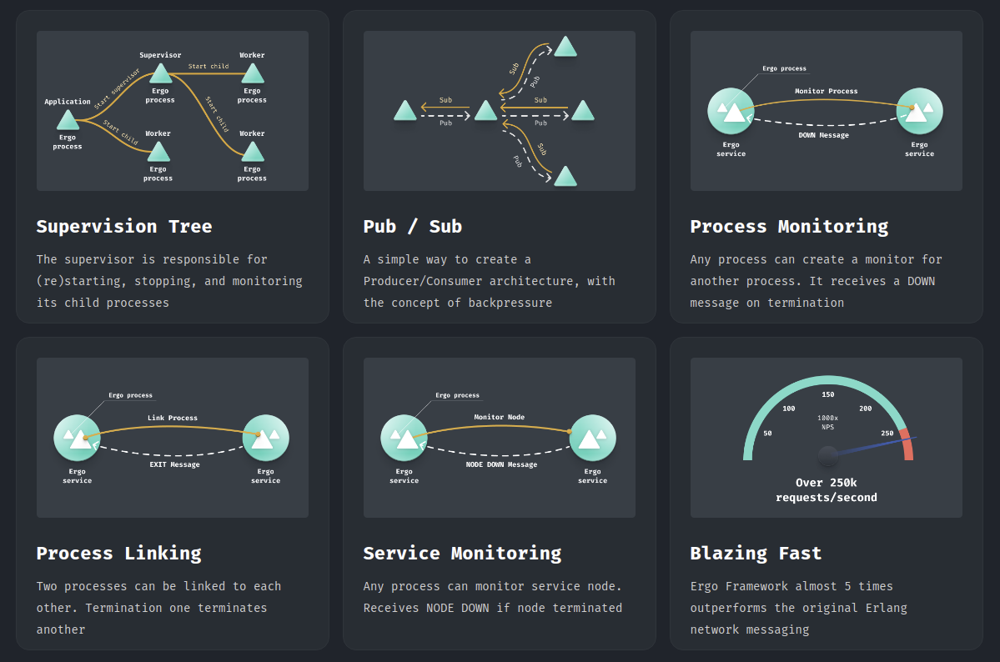

# Обзор

## Features

* Support Erlang 24 (including [Alias](https://blog.erlang.org/My-OTP-24-Highlights/#eep-53-process-aliases) and [Remote Spawn](https://blog.erlang.org/OTP-23-Highlights/#distributed-spawn-and-the-new-erpc-module) features)
* Spawn Erlang-like processes
* Register/unregister processes with simple atom
* `gen.Server` behavior support (with atomic state)
* `gen.Supervisor` behavior support with all known [restart strategies](https://erlang.org/doc/design\_principles/sup\_princ.html#restart-strategy) support
  * One For One
  * One For All
  * Rest For One
  * Simple One For One
* `gen.Application` behavior support with all known [starting types](https://erlang.org/doc/design\_principles/applications.html#application-start-types) support
  * Permanent
  * Temporary
  * Transient
* `gen.Stage` behavior support (originated from Elixir's [GenStage](https://hexdocs.pm/gen\_stage/GenStage.html)). This is abstraction built on top of `gen.Server` to provide a simple way to create a distributed Producer/Consumer architecture, while automatically managing the concept of backpressure. This implementation is fully compatible with Elixir's GenStage. Example is here [examples/genstage](https://github.com/ergo-services/ergo/blob/CustomHandshake/examples/genstage) or just run `go run ./examples/genstage` to see it in action
* `gen.Saga` behavior support. It implements Saga design pattern - a sequence of transactions that updates each service state and publishes the result (or cancels the transaction or triggers the next transaction step). `gen.Saga` also provides a feature of interim results (can be used as transaction progress or as a part of pipeline processing), time deadline (to limit transaction lifespan), two-phase commit (to make distributed transaction atomic). Here is example [examples/gensaga](https://github.com/ergo-services/ergo/blob/CustomHandshake/examples/gensaga).
* Connect to (accept connection from) any Erlang node within a cluster
* Making sync request `ServerProcess.Call`, async - `ServerProcess.Cast` or `Process.Send` in fashion of `gen_server:call`, `gen_server:cast`, `erlang:send` accordingly
* Monitor processes/nodes
  * local -> local
  * local -> remote
  * remote -> local
* Link processes
  * local <-> local
  * local <-> remote
  * remote <-> local
* RPC callbacks support
* [embedded EPMD](https://github.com/ergo-services/ergo/tree/CustomHandshake#epmd) (in order to get rid of erlang' dependencies)
* Experimental [observer support](https://github.com/ergo-services/ergo/tree/CustomHandshake#observer)
* Unmarshalling terms into the struct using `etf.TermIntoStruct`, `etf.TermProplistIntoStruct` or to the string using `etf.TermToString`
* Custom marshaling/unmarshaling via `Marshal` and `Unmarshal` interfaces
* Encryption (TLS 1.3) support (including autogenerating self-signed certificates)
* Tested and confirmed support Windows, Darwin (MacOS), Linux, FreeBSD.

### Requirements

Go 1.15.x and above

